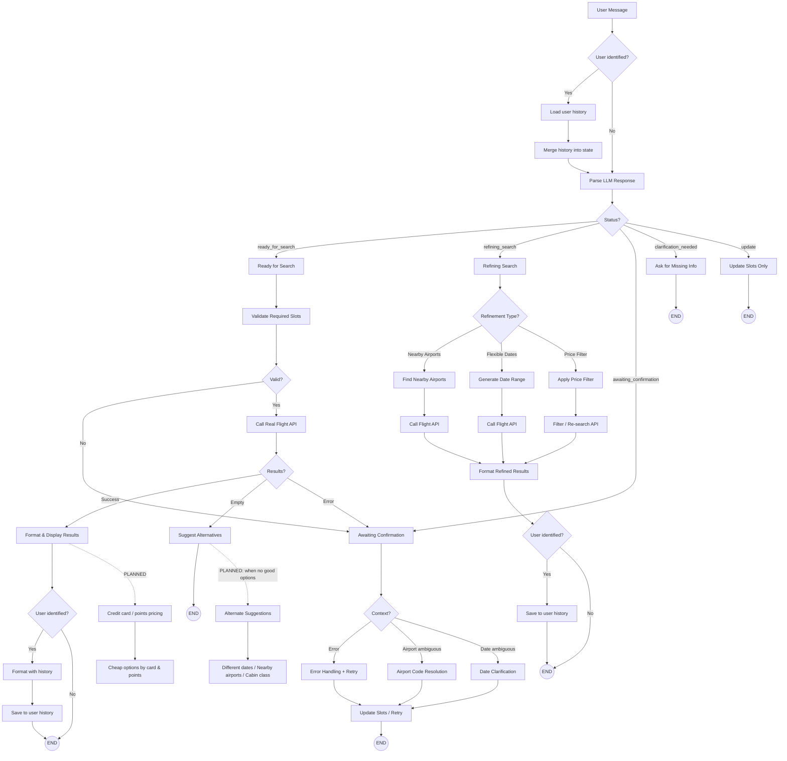

# Flight Finder – Workflow Diagram (Excalidraw-friendly)

Use this to redraw in Excalidraw. Each **box** = one rectangle; each **arrow** = one connector.

---

## 1. Excalidraw copy-paste guide (shapes + arrows)

**Central flow (left → right):**

| # | Shape label | Type |
|---|-------------|------|
| 1 | **User Message** | Rounded rect (start) |
| 2 | **Parse LLM Response** | Rect |
| 3 | **Status?** | Diamond |
| 4 | **Ready for Search** | Rect |
| 5 | **Refining Search** | Rect |
| 6 | **Awaiting Confirmation** | Rect |
| 7 | **Clarification (ask missing info)** | Rect |
| 8 | **Update Slots Only** | Rect |

**Ready-for-search branch:**

| # | Shape label |
|---|-------------|
| 9 | Validate Required Slots |
| 10 | Valid? (diamond) |
| 11 | Call Real Flight API |
| 12 | Results? (Success / Empty / Error) (diamond) |
| 13 | Format & Display Results |
| 14 | Suggest Alternatives |
| 15 | (back to) Awaiting Confirmation |

**Refining-search branch:**

| # | Shape label |
|---|-------------|
| 16 | Refinement Type? (diamond) |
| 17 | Nearby Airports → Find Nearby → Call API |
| 18 | Flexible Dates → Date Range → Call API |
| 19 | Price Filter → Filter / Re-search API |
| 20 | Format Results |

**Awaiting-confirmation branch:**

| # | Shape label |
|---|-------------|
| 21 | Error Handling (retry/backoff) |
| 22 | Airport Code Resolution → Update Slots |
| 23 | Date Ambiguity → Update Slots |

**Historical (per-person) workflow:**

| # | Shape label | Type |
|---|-------------|------|
| 26 | **User identified?** | Diamond |
| 27 | **Load user history** (from persistent store) | Rect |
| 28 | **Merge history into state** (e.g. search_history, prefill) | Rect |
| 29 | **Save to user history** (params + result summary) | Rect |
| 30 | **Format with history** (e.g. "Your recent routes", personalized) | Rect (extends Format Results) |

**Planned (future):**

| # | Shape label |
|---|-------------|
| 24 | **Credit card / points pricing** (from Price Filter or Results) |
| 25 | **Alternate suggestions** (when no good options: dates, airports, cabin) |

**Arrows to draw:**

- User Message → User identified?  
- User identified? → Load user history (if Yes) | Parse LLM Response (if No or after Load)  
- Load user history → Merge history into state → Parse LLM Response  
- User identified? → Parse LLM Response (if No, skip history)  
- Parse LLM Response → Status?  
- Status? → Ready for Search | Refining Search | Awaiting Confirmation | Clarification | Update  
- Ready for Search → Validate Slots  
- Validate Slots → Valid? → Call API (if Valid) or Awaiting Confirmation (if Invalid)  
- Call API → Results? → Format Results (Success) | Suggest Alternatives (Empty) | Awaiting Confirmation (Error)  
- Refining Search → Refinement Type? → Nearby / Flexible Dates / Price Filter → (each path) → Call API or Filter → Format Results  
- Awaiting Confirmation → Error Handling | Airport Resolution | Date Clarification → Update Slots  
- Clarification → END (user sees message)  
- Update → END  
- **History:** Format & Display Results → User identified? (diamond) → Save to user history (if Yes) → END  
- **History:** Format Refined Results → User identified? → Save to user history (if Yes) → END  
- **History:** When formatting, if user has history → use "Format with history" (personalized message)  

---

## 2. Mermaid flowchart (current + planned + historical)



---

## 3. Short summary for Excalidraw

**Historical (per-person) – before main flow:**

0. **User identified?** → **Yes:** Load user history → Merge history into state → then Parse LLM. **No:** go straight to Parse LLM.

**Five main workflows (after Parse LLM → Status?):**

1. **Ready for Search**  
   Validate slots → Call API → Success → Format results **or** Empty/Error → Suggest alternatives or Awaiting confirmation.

2. **Refining Search**  
   By type: **Nearby airports** (find nearby → call API), **Flexible dates** (date range → call API), **Price filter** (filter + re-search) → Format refined results.

3. **Awaiting Confirmation**  
   **Error** → retry/backoff; **Airport ambiguous** → resolve airport → update slots; **Date ambiguous** → clarify → update slots.

4. **Clarification needed**  
   Ask for missing info → END.

5. **Update**  
   Update slots only → END.

**Historical (per-person) – after results:** After **Format & Display Results** or **Format Refined Results**: **User identified?** → **Yes:** Format with history → **Save to user history** → END. **No:** END.

**Planned (draw with dashed lines or a “Future” swimlane):**

- **Cheap options by credit card / points** – from “Format & Display Results” (or from Price Filter).
- **Alternate suggestions when no good options** – extend “Suggest Alternatives” with e.g. different dates, nearby airports, cabin class.

---

## 4. Minimal Excalidraw layout (zones) – all workflows including historical

```
[User Message] → [User identified?]
       ↓                  ↓
       ↓ Yes        No → [Parse LLM] → [Status?]
       ↓                  ↓
 [Load user history]      ┌────┼────┬────────┬────────────┐
       ↓                  ↓    ↓    ↓        ↓            ↓
 [Merge history into state] → [Parse LLM]
 Clarify  Update  Ready   Refining  Awaiting
    ↓    ↓     ↓        ↓            ↓
   END  END  Validate  Type?    Error/Airport/Date
            ↓    ↓       ↓            ↓
         API  Confirm  Nearby/     Update → END
          ↓     ↓      Dates/Price
       Results?  ↓         ↓
          ↓   END     [Format Refined] → [User identified?] → [Save to user history] → END
 [Format & Display Results] → [User identified?]
          ↓ Yes                    ↓ No
 [Format with history]             END
          ↓
 [Save to user history] → END
          ↓
 (PLANNED: Credit card/points)
 (PLANNED: Alternate suggestions)
```

You can paste this into Excalidraw as text boxes, then replace with shapes and connect with arrows.

---

## 5. Historical analysis & per-person history

**Which workflow maintains historical analysis?**  
**None.** The five workflows above are all **in-session only**: they use `chat_history` and `search_history` from Streamlit session state, which is in-memory and lost when the user closes the tab or starts a new chat. There is no persistent storage and no per-person identity, so no workflow currently “maintains” historical analysis across sessions or “per person.”

To **store history for each person and give them results accordingly**, you need a **new capability** (new workflow or extensions to existing ones):

### 5.1 What to add

| Concept | Description |
|--------|-------------|
| **User identity** | A stable id per person (e.g. login user_id, or persistent session_id stored in cookie/DB). |
| **Persistent store** | DB or file store keyed by user id: e.g. past searches, past results, preferences, conversation summaries. |
| **Load on start** | When a user starts or returns: load their history from the store and optionally prefill slots or suggest “Continue from last search.” |
| **Save after actions** | After **Ready for Search** (and optionally after **Refining Search**): append to that user’s history (search params, result summary, timestamps). |
| **Use when returning results** | When formatting results, optionally inject “Last time you searched X–Y we found …” or “Your recent routes: …” from their stored history. |

### 5.2 Where it fits in the diagram

- **New box (e.g. “Load user history”)**  
  - After **User Message** (or at session start): if user is identified → load user’s history from store → optionally merge into state (e.g. `search_history`, or a dedicated `user_history`).
- **Extend “Format & Display Results”**  
  - When formatting results, if user has history → include per-person context (e.g. “Your previous searches,” “Results for you”).
- **New box (e.g. “Save to user history”)**  
  - After **Format & Display Results** (and optionally after **Format Refined Results**): if user is identified → append this search (params + result summary) to persistent store.

So the workflow that would **maintain** historical analysis is this new **“Per-person history”** flow: **Load user history → [existing flows] → Save to user history**, with **Format & Display Results** (and refined path) using that history to “give results accordingly” (e.g. personalized summary or suggestions).
